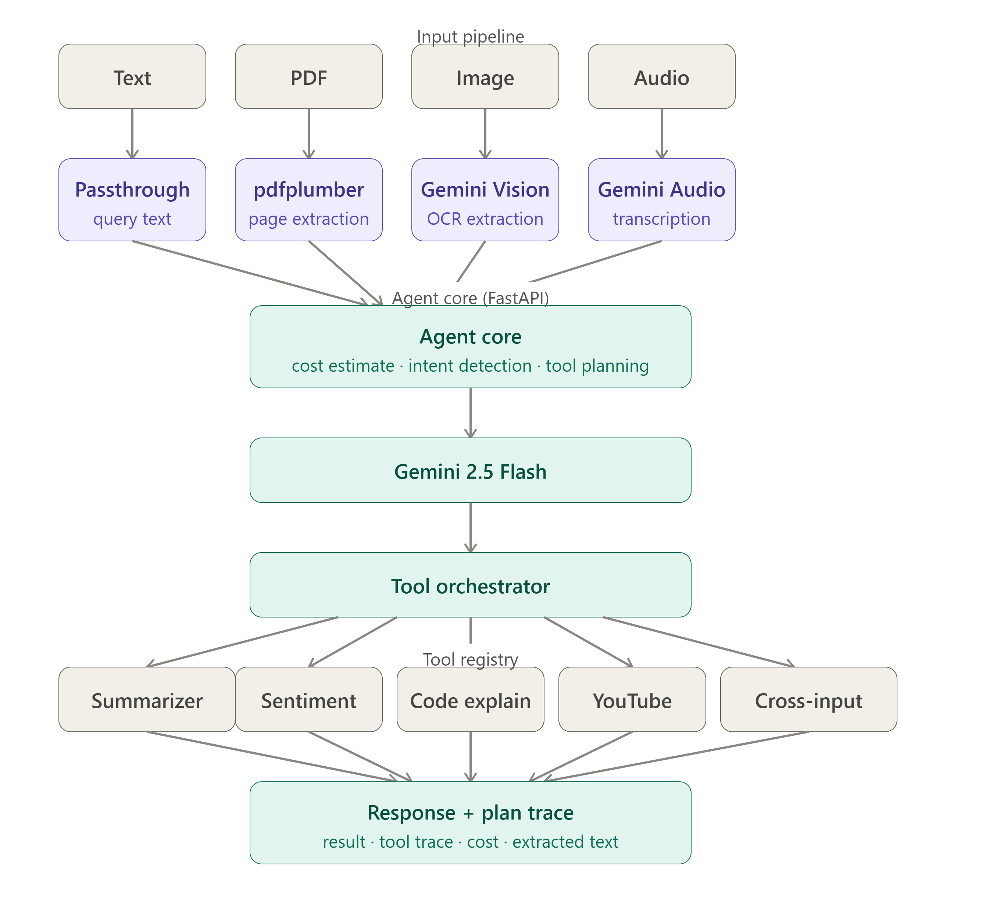

# Parallel Minds Agent — Multimodal Agentic AI

A deployed agentic AI application that accepts Text, Images, PDFs, and Audio simultaneously, 
understands user intent, and autonomously chains the correct tools to complete complex tasks.

## Live Demo
[https://parallel-minds-agent.onrender.com](https://parallel-minds-agent.onrender.com)

## Tech Stack
- **Backend**: FastAPI + Python 3.12
- **LLM**: Google Gemini 2.5 Flash
- **PDF Parsing**: pdfplumber
- **OCR**: pytesseract + Tesseract
- **Audio**: Gemini native audio understanding
- **YouTube**: youtube-transcript-api
- **Frontend**: Vanilla HTML/CSS/JS
- **Deployment**: Docker + Render

## Architecture



## Setup

### Prerequisites
- Python 3.12+
- Tesseract OCR installed
- ffmpeg installed
- Google Gemini API key

### Installation
```bash
git clone https://github.com/Shrau1711/parallel-minds-assignment
cd parallel-minds-assignment/backend
python -m venv venv
venv\Scripts\activate
pip install -r requirements.txt
```

### Environment Variables
Create a `.env` file inside the `backend/` folder:

GEMINI_API_KEY=your_gemini_api_key_here

TESSERACT_PATH=C:\Program Files\Tesseract-OCR\tesseract.exe

GEMINI_MODEL=gemini-2.5-flash

### Run Locally
```bash
cd backend
uvicorn main:app --reload
```
Open `http://127.0.0.1:8000`

### Docker
```bash
docker build -t parallel-minds-agent .
docker run -p 8000:8000 -e GEMINI_API_KEY=your_key parallel-minds-agent
```

## Design Decisions

**Why no LangChain?**
The orchestration logic is written from scratch in `agent.py`. This gives full control 
over tool selection, error handling, and the plan trace — and avoids the overhead and 
abstraction of frameworks.

**Why Gemini for everything?**
Gemini 2.5 Flash is multimodal, fast, and free-tier accessible. Using one model for 
intent detection, summarization, sentiment, code explanation, and audio transcription 
keeps the stack simple and consistent.

**Why vanilla JS frontend?**
No build step needed, instant load, easy to deploy. The chat UI is fully custom with 
a sidebar for extracted file previews and an agent trace panel.

**Agentic design**
The agent follows a plan-then-execute pattern. It first estimates cost, detects 
special inputs (YouTube URLs), determines intent via Gemini, then executes the minimum 
viable tool sequence. Each step is logged to the trace visible in the UI.

## Test Cases

### Test 1 — Audio Transcription + Summary
Upload an MP3 file and ask: "Summarize this audio"

### Test 2 — PDF + Natural Language Query  
Upload a PDF and ask: "What are the action items?"

### Test 3 — Image with Code
Upload a screenshot of code and ask: "Explain this"

### Test 4 — Cross-Input Multi-Tool Chain
Upload a PDF containing a YouTube URL and ask:
"Hit the YouTube URL in this PDF and summarize it"

### Test 5 — Multi-File Unified Query
Upload an audio file + PDF and ask:
"Do the audio and document discuss the same topic?"

## Bonus Features
- Cost estimator: token count + USD estimate shown before execution
- Tool call visualization: step-by-step agent trace in the UI